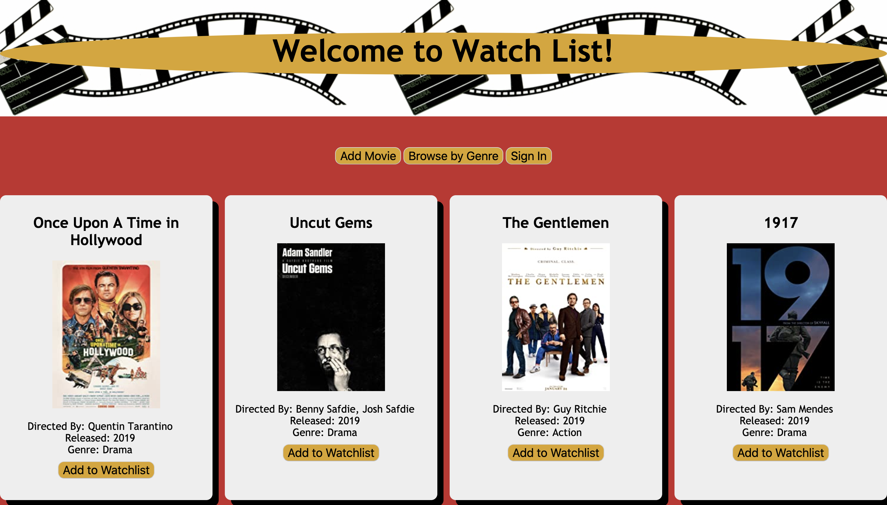

# README

## Watchlist

A single-page JavaScript app with a Rails back-end meant for movie-lovers to browse films and track their viewing. Users can browse the films already in the database, filter by genre, and add new films. They can also log-in to view their individual watchlist.  
